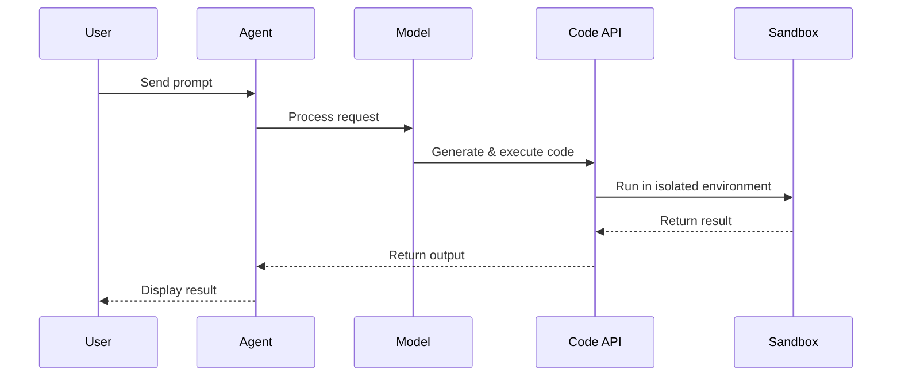

## Overview

The Code Interpreter capability allows AI models to write and execute Python code in a secure sandboxed environment. This enables data analysis, mathematical computations, file processing, and more.

## How It Works

When enabled, the AI can:

- Write and execute Python code
- Process uploaded files (CSV, JSON, images, etc.)
- Generate visualizations and charts
- Perform complex calculations
- Analyze data and return results

Code runs in an isolated sandbox environment with timeout limits for security.

## Setup

<Steps>
  <Step title="Get API Key">
    Obtain a code interpreter API key from [code.librechat.ai](https://code.librechat.ai) or configure your own service.
  </Step>
  
  <Step title="Configure Environment">
    Add your API key to the `.env` file:
    
    ```bash
    # .env
    LIBRECHAT_CODE_API_KEY=your-key-here
    ```
  </Step>
  
  <Step title="Enable in Agent Configuration">
    In `librechat.yaml`, ensure code execution is enabled:
    
    ```yaml
    endpoints:
      agents:
        capabilities:
          - execute_code
    ```
  </Step>
</Steps>

## Using Code Interpreter

### In Agents

<Steps>
  <Step title="Open Agent Builder">
    Create a new agent or edit an existing one.
  </Step>
  
  <Step title="Enable Code Execution">
    Toggle **Run Code** in the capabilities section.
  </Step>
  
  <Step title="Configure API Key (if user-provided)">
    If using user-provided authentication, click the key icon to add your API key.
  </Step>
</Steps>

### Example Prompts

<Tabs>
  <Tab title="Data Analysis">
    ```
    Analyze this CSV file and show me:
    1. Summary statistics
    2. Missing values
    3. Top 5 correlations
    ```
  </Tab>
  
  <Tab title="Visualization">
    ```
    Create a bar chart comparing sales by region.
    Use the data from the uploaded spreadsheet.
    ```
  </Tab>
  
  <Tab title="Math & Computation">
    ```
    Calculate the compound interest for:
    - Principal: $10,000
    - Rate: 5% annually
    - Time: 10 years
    - Compounded monthly
    ```
  </Tab>
  
  <Tab title="File Processing">
    ```
    Convert this JSON file to a formatted CSV with:
    - Header row
    - Sorted by timestamp
    - Only include columns: id, name, status
    ```
  </Tab>
</Tabs>

## File Upload Support

Code Interpreter can work with uploaded files:

<Accordion title="Supported File Types">
  - **Data**: CSV, JSON, Excel (.xlsx), TSV
  - **Text**: TXT, MD, PDF
  - **Images**: PNG, JPG, GIF (for analysis)
  - **Code**: Python (.py), Jupyter notebooks (.ipynb)
</Accordion>

<Note>
  Files are processed in the execution environment. Maximum file size depends on your configuration.
</Note>

## Configuration Options

### Agent-Level Settings

Configure code execution for specific agents:

```typescript
// Agent form capabilities
{
  execute_code: true,
  tool_options: {
    timeout: 60000  // milliseconds
  }
}
```

### System-Level Settings

Configure globally in `librechat.yaml`:

```yaml
endpoints:
  agents:
    capabilities:
      - execute_code
    # Set default recursion limit for code execution loops
    recursionLimit: 25
```

## Authentication Types

Code Interpreter supports different authentication methods:

<Tabs>
  <Tab title="System-Provided">
    Admin configures a shared API key:
    
    ```bash
    # .env
    LIBRECHAT_CODE_API_KEY=system-wide-key
    ```
    
    All users can execute code without individual keys.
  </Tab>
  
  <Tab title="User-Provided">
    Users supply their own API keys:
    
    1. Click the key icon in the agent builder
    2. Enter your personal API key
    3. Key is encrypted and stored securely
    
    <Warning>
      User-provided keys are stored encrypted using `CREDS_KEY` and `CREDS_IV` from your `.env` file.
    </Warning>
  </Tab>
</Tabs>

## Code Execution Flow



## Security

<Info>
  Code execution happens in a sandboxed environment with:
  
  - **Isolated processes**: Each execution runs separately
  - **Timeout limits**: Prevents infinite loops
  - **Resource constraints**: Memory and CPU limits
  - **No network access**: (Default) Sandbox cannot make external requests
</Info>

## Limitations

- **Timeout**: Code execution has time limits (typically 60 seconds)
- **Package restrictions**: Only pre-installed Python packages are available
- **No persistence**: Environment resets between executions
- **File size limits**: Large files may exceed processing limits

## API Key Dialog

When using user-provided authentication, a dialog allows key management:

```typescript
// API Key Dialog features
- Add new API key
- Revoke existing key
- Test connection
- Secure encrypted storage
```

## Troubleshooting

<Accordion title="Code execution fails">
  - Verify `LIBRECHAT_CODE_API_KEY` is set correctly
  - Check API key validity at code.librechat.ai
  - Ensure the code interpreter service is reachable
</Accordion>

<Accordion title="Timeout errors">
  - Simplify complex operations
  - Break large tasks into smaller steps
  - Optimize code for performance
</Accordion>

<Accordion title="Import errors">
  - Check which packages are pre-installed in the sandbox
  - Use standard library modules when possible
  - Contact admin to add custom packages
</Accordion>

## Best Practices

<Tip>
  - **Test with small data first**: Verify code works before processing large files
  - **Clear instructions**: Tell the AI exactly what you want to compute
  - **Error handling**: Ask the AI to include error checking in code
  - **Visualizations**: Request charts and graphs for better insights
  - **Iterate**: Refine code across multiple messages
</Tip>

## Related Features

- [Agents](/features/agents)
- [Multimodal Chat](/features/multimodal-chat)
- [Artifacts](/features/artifacts)