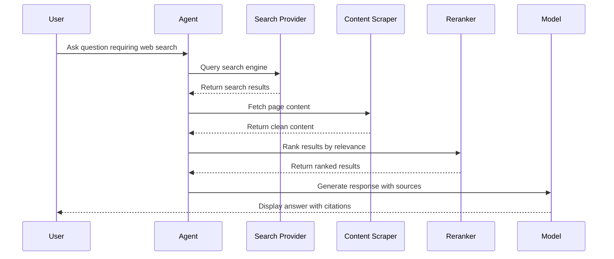

## Overview

Web Search allows AI agents to search the internet, retrieve current information, and cite sources in their responses. This capability is essential for tasks requiring real-time data, news, research, or fact-checking.

## How It Works

The web search system uses three components:

1. **Search Provider**: Queries search engines (Serper, SearXNG)
2. **Content Scraper**: Extracts clean content from web pages (Firecrawl)
3. **Reranker**: Improves result relevance (Jina, Cohere)

## Configuration

<Steps>
  <Step title="Choose Search Provider">
    Configure one of the supported search providers:
    
    <Tabs>
      <Tab title="Serper (Recommended)">
        Get an API key from [serper.dev](https://serper.dev):
        
        ```bash
        # .env
        SERPER_API_KEY=your-serper-key
        ```
        
        ```yaml
        # librechat.yaml
        webSearch:
          serperApiKey: '${SERPER_API_KEY}'
        ```
      </Tab>
      
      <Tab title="SearXNG (Self-Hosted)">
        Use your own SearXNG instance:
        
        ```bash
        # .env
        SEARXNG_INSTANCE_URL=https://your-searxng.com
        SEARXNG_API_KEY=optional-api-key
        ```
        
        ```yaml
        # librechat.yaml
        webSearch:
          searxngInstanceUrl: '${SEARXNG_INSTANCE_URL}'
          searxngApiKey: '${SEARXNG_API_KEY}'
        ```
      </Tab>
    </Tabs>
  </Step>
  
  <Step title="Configure Content Scraper">
    Set up Firecrawl for extracting web content:
    
    ```bash
    # .env
    FIRECRAWL_API_KEY=your-firecrawl-key
    FIRECRAWL_API_URL=https://api.firecrawl.dev  # Optional
    ```
    
    ```yaml
    # librechat.yaml
    webSearch:
      firecrawlApiKey: '${FIRECRAWL_API_KEY}'
      firecrawlApiUrl: '${FIRECRAWL_API_URL}'  # Optional
    ```
  </Step>
  
  <Step title="Configure Reranker (Required)">
    Choose a reranking service to improve result quality:
    
    <Tabs>
      <Tab title="Jina">
        ```bash
        # .env
        JINA_API_KEY=your-jina-key
        ```
        
        ```yaml
        # librechat.yaml
        webSearch:
          jinaApiKey: '${JINA_API_KEY}'
          # jinaApiUrl: 'https://api.jina.ai/v1/rerank'  # Optional
        ```
      </Tab>
      
      <Tab title="Cohere">
        ```bash
        # .env
        COHERE_API_KEY=your-cohere-key
        ```
        
        ```yaml
        # librechat.yaml
        webSearch:
          cohereApiKey: '${COHERE_API_KEY}'
        ```
      </Tab>
    </Tabs>
  </Step>
  
  <Step title="Enable in Agent Configuration">
    Ensure web search is available for agents:
    
    ```yaml
    # librechat.yaml
    endpoints:
      agents:
        capabilities:
          - web_search
    ```
  </Step>
</Steps>

## Using Web Search

### Enable for an Agent

<Steps>
  <Step title="Open Agent Builder">
    Create a new agent or edit an existing one.
  </Step>
  
  <Step title="Enable Web Search">
    Toggle **Web Search** in the capabilities section.
  </Step>
  
  <Step title="Configure API Keys (if user-provided)">
    If using user-provided authentication:
    
    1. Click the key icon next to Web Search
    2. Enter required API keys:
       - Search provider (Serper or SearXNG)
       - Content scraper (Firecrawl)
       - Reranker (Jina or Cohere)
  </Step>
</Steps>

### Example Queries

<Tabs>
  <Tab title="Current Events">
    ```
    What are the latest developments in AI regulation?
    ```
  </Tab>
  
  <Tab title="Research">
    ```
    Find recent studies on the health effects of intermittent fasting.
    Include peer-reviewed sources from the last 2 years.
    ```
  </Tab>
  
  <Tab title="Fact-Checking">
    ```
    Is it true that [claim]? Find reliable sources to verify.
    ```
  </Tab>
  
  <Tab title="Product Research">
    ```
    Compare the top 3 project management tools for remote teams.
    Include pricing, features, and user reviews.
    ```
  </Tab>
</Tabs>

## Authentication Types

<Tabs>
  <Tab title="System-Provided">
    Admin configures shared API keys:
    
    ```bash
    # .env
    SERPER_API_KEY=system-key
    FIRECRAWL_API_KEY=system-key
    JINA_API_KEY=system-key
    ```
    
    All users can use web search without individual keys.
  </Tab>
  
  <Tab title="User-Provided">
    Users supply their own API keys:
    
    1. Click the key icon in the agent builder
    2. Enter API keys for each service
    3. Keys are encrypted and stored securely
    
    <Info>
      User-provided keys allow users to use their own API quotas and subscriptions.
    </Info>
  </Tab>
  
  <Tab title="Mixed">
    Combine system and user-provided keys:
    
    - System provides some keys (e.g., search provider)
    - Users provide others (e.g., premium Firecrawl account)
  </Tab>
</Tabs>

## Search Flow



## Citations

Web search results include automatic citations:

```
According to recent research [1], intermittent fasting has shown...

Sources:
[1] "Health Effects of Intermittent Fasting" - Nature.com (2024)
```

<Note>
  Citations appear as numbered references inline and a source list at the end of the response.
</Note>

## Advanced Configuration

### Custom Firecrawl URL

Use a self-hosted or custom Firecrawl instance:

```yaml
# librechat.yaml
webSearch:
  firecrawlApiUrl: 'https://your-firecrawl.com'
```

### Custom Jina Endpoint

```yaml
# librechat.yaml
webSearch:
  jinaApiUrl: 'https://custom-jina.com/v1/rerank'
```

## Troubleshooting

<Accordion title="No search results returned">
  - Verify all required API keys are configured
  - Check API key validity and quotas
  - Ensure network connectivity to search services
  - Review logs for specific error messages
</Accordion>

<Accordion title="Poor result quality">
  - Ensure reranker (Jina/Cohere) is configured
  - Try alternative search queries
  - Check if search provider has region restrictions
</Accordion>

<Accordion title="Slow searches">
  - Content scraping can be slow for large pages
  - Firecrawl performance depends on target websites
  - Consider upgrading to premium API tiers
</Accordion>

<Accordion title="API quota exceeded">
  - Monitor API usage in provider dashboards
  - Upgrade API plans if needed
  - Enable user-provided keys for distributed costs
</Accordion>

## Security Considerations

<Warning>
  - Search results come from external sources - treat as untrusted input
  - Content scrapers may access sensitive URLs if not properly configured
  - User-provided API keys are encrypted but should follow security best practices
</Warning>

## Cost Optimization

<Tip>
  - **Caching**: Search results can be cached to reduce API calls
  - **User-provided keys**: Distribute API costs across users
  - **Rate limiting**: Configure limits in `librechat.yaml`
  - **SearXNG**: Self-host for unlimited free searches
</Tip>

## Best Practices

- **Specific queries**: Help the AI search more effectively with clear questions
- **Source verification**: Ask the AI to cite specific sources
- **Recency**: Specify time ranges when currency matters
- **Multiple sources**: Request information from multiple sources for verification

## Related Features

- [Agents](/features/agents)
- [Code Interpreter](/features/code-interpreter)
- [Artifacts](/features/artifacts)